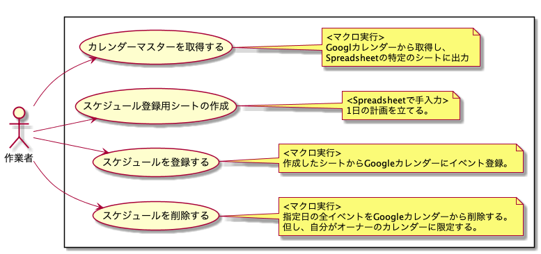

# gas-insert-gcal-schedules
## やりたかったこと
- 1日のタイムラインをGoogleカレンダーで管理したい。
- 計画立てる作業はスプレッドシートで作業したい。
  - カレンダーアプリより、作業早い。
  - テンプレートのカスタマイズも容易。

## ユースケース


## 使い方
1. 下記スプレッドシートをコピーして利用。
  [🔗公開用スプレッドシート](https://docs.google.com/spreadsheets/d/1oMmu-fvZKE3d0zoVQx_MNwKd1bTfFra7_22RTwoTD4Y/edit?usp=sharing)
2. 「<<カスタム>>」メニューから「①カレンダーリストの読み込み」を実行。
3. 「TMP」シートをコピーし、予定を作成する。
4. 「<<カスタム>>」メニューから「②スケジュール登録」を実行。

## 開発環境作成
- `npm install` 実行する。
- `.clasp.json` を作成する。

## 実装時のメモ
JavaScript、TypeScriptを勉強しながら実装。以下、覚書。

### 型判定の方法
🔗[JavaScriptの「型」の判定について - Qiita](https://qiita.com/south37/items/c8d20a069fcbfe4fce85)
```js
var toString = Object.prototype.toString

toString.call({});                // [object Object]  
toString.call([]);                // [object Array]
toString.call(function() {});    	// [object Function]
toString.call(new Error());       // [object Error]
toString.call(new Date());        // [object Date]
toString.call(JSON);              // [object JSON]
toString.call(Math);              // [object Math]
toString.call(new RegExp());      // [object RegExp]
toString.call(new String('str')); // [object String]
toString.call(new Number(1));     // [object Number]
toString.call(new Boolean(true)); // [object Boolean]
toString.call('str'); 	// [object String]
toString.call(1);     	// [object Number]
toString.call(true);  	// [object Boolean]
```

### tscでコンパイルエラー

```
node_modules/@types/google-apps-script/google-apps-script.base.d.ts:512:13 - error TS2403: Subsequent variable declarations must have the same type.  Variable 'console' must be of type 'Console', but here has type 'console'.

512 declare var console: GoogleAppsScript.Base.console;
                ~~~~~~~

  ../../.nodebrew/node/v13.5.0/lib/node_modules/typescript/lib/lib.dom.d.ts:19729:13
    19729 declare var console: Console;
                      ~~~~~~~
    'console' was also declared here.
```

#### 解決策
🔗[[@types/google-apps-script] Variable 'console' must be of type 'Console', but here has type 'console'. TS2403 · Issue #32585 · DefinitelyTyped/DefinitelyTyped](https://github.com/DefinitelyTyped/DefinitelyTyped/issues/32585)
- 'tsconfig.json'のオプション`lib`に`DOM`を含まないようにすれば良いとのこと。

```
Note: If --lib is not specified a default list of libraries are injected. The default libraries injected are:
► For --target ES5: DOM, ES5, ScriptHost
► For --target ES6: DOM, ES6, DOM.Iterable, ScriptHost
``` 

### GAS用にトランスコンパイル
🔗[GAS を npm パッケージ + Webpack + TypeScript で開発する - Qiita](https://qiita.com/shohei_ot/items/7b26461359068a192b96)

- GASではES6のimport、exportの表記使えないので、1ファイルにする必要がある。
  →webpackの導入。
- webpackではトップレベルで関数宣言をする必要がある。しかし、 webpackで1ファイルにバンドルするとwebpackの関数スコープに閉じ込められてしまいglobalから参照出来ない形で出力されてしまう。
  →プラグインの導入
  - gas-webpack-plugin
  - es3ify-webpack-plugin
- tsファイルでは、globalオブジェクトに関数追加する実装へ変更する。
- 参考サイトに載っていた、watchモードもついでに導入。

### 所感
- 学習中のDDD（オニオンアーキテクチャ）、TypeScriptで開発したかった。
  データベースを利用しない実装の為、ドメイン（エンティティ）の部分を無理やり作った感あり。
- ESLint、とくにフォーマッターのPretterの理解が不十分な為、今後の課題。
- Jestでユニットテストしたかったが、作業時間の都合で割愛。別ツール開発時に試す。

### (2021/01/28) WebApi化
- Today、Tomorrow指定で「メイン」シートのスケジュールを登録できるようにする。